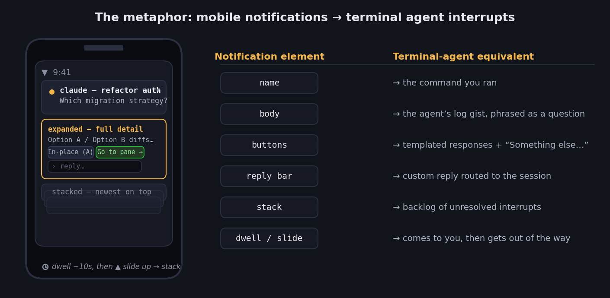
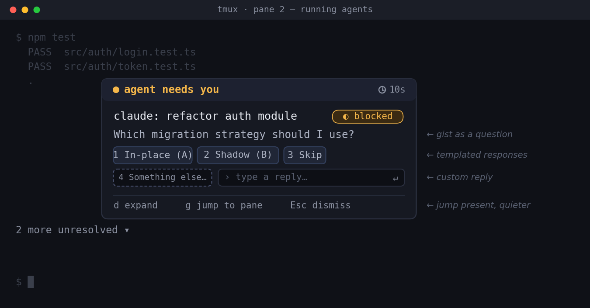
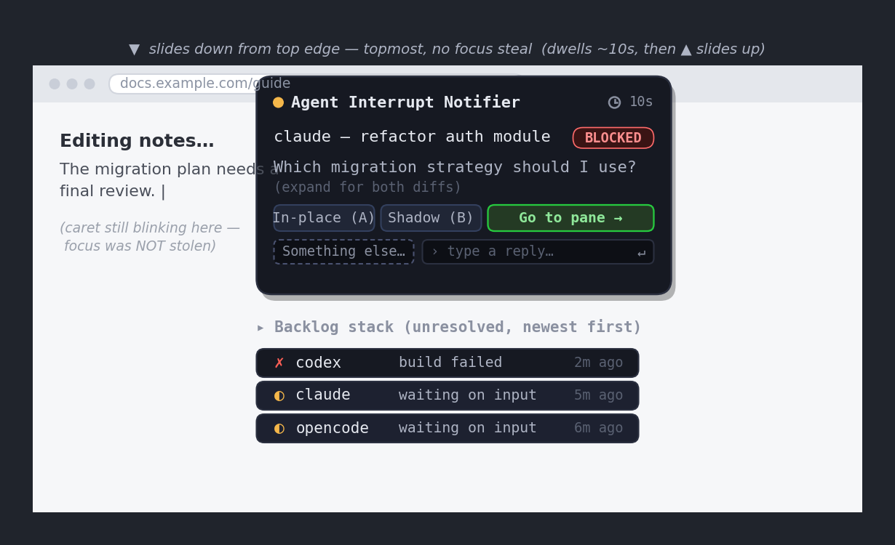

# Agent Interrupt Notifier

**Proposal for an attention-aware notifier for terminal-based AI agent workflows- when the user is still in a terminal (TUI), or left for the desktop (GUI). Agent interruption handled smooth like butter.**

> **Status:** Proposal — GitHub Issues TBD

---

## The Problem

Developers increasingly run multiple terminal-based AI agents (Claude Code, Codex CLI, OpenCode, and similar harnesses) that work autonomously for minutes at a time. While an agent works, the developer moves on — a different command, a different pane, or out of the terminal entirely into a browser or another app. The problem is the **return trip**: when an agent **finishes** or **gets blocked needing input**, there is no good way to find out without babysitting the terminal it runs in.

Today the user cannot:

- **Find out promptly, wherever they are** — the current options are to watch the terminal (defeating delegation) or check back manually (an attention tax that scales badly with the number of concurrent agents)
- **Distinguish _done_ from _blocked_ from _errored_** at a glance, without scrolling the log
- **Act on the interrupt without a full context switch** — approve, answer a quick question, or redirect, without diving all the way back into the session
- **Jump straight to the exact pane that needs them** — instead of hunting across several panes for the one that's blocked
- **Catch up on what they missed** on their own terms, without a standing UI cluttering the screen

As the number of parallel agentic workflows grows, the cost of _managing the interrupts_ threatens to become the job itself. This problem exists whether the user is **still in a terminal** or **away in a GUI app** — the two surfaces differ, but the underlying need is identical.

---

## Two Proposals, Shared Infrastructure

This repository contains two companion proposals targeting the two "worlds" a user can be in when an agent needs them. Both share the same underlying infrastructure (harness adapters that parse logs, an orchestrator that phrases the gist as a question and generates responses, a two-stage event protocol, attention detection, and a delivery router) but deliver different experiences matched to where the user's attention is.

The design borrows its interaction model from mobile OS notifications:



```
┌─────────────────────────────────────────────────────────┐
│                  Shared Infrastructure                    │
│  Adapters (parse logs) · Orchestrator (phrase as question │
│  + templates + lifecycle) · Attention Detector ·          │
│  Delivery Router · Pull Surface (backlog stack)           │
└─────────────┬────────────────────────────┬──────────────┘
              │                            │
    ┌─────────▼──────────┐      ┌─────────▼───────────────┐
    │  Proposal A: TUI    │      │  Proposal B: GUI/Desktop │
    │  (user in terminal) │      │  (user left terminal)    │
    │                     │      │                          │
    │  fzf-style overlay  │      │  Custom slide-in banner  │
    │  in the focused pane │      │  topmost, no focus steal │
    │  focus-event detect │      │  Foreground-window detect│
    │  tmux status nudge  │      │  Click-to-raise + jump   │
    │  Templates + bar    │      │  Templates + bar         │
    │  Jump-to-pane       │      │  Jump-to-pane            │
    └─────────────────────┘      └──────────────────────────┘
```

Both variants carry the **same two interaction affordances** — they differ only in emphasis:

- **Inline actions** — the gist is phrased as a question, answered with contextual templated responses plus a "Something else…" freeform prompt bar, so the user can respond _without opening the underlying session_.
- **Jump-to-pane** — a one-click return that puts the user in the exact pane that's waiting, prompt visible, for when the interrupt deserves immediate, detailed attention.

### Phasing

- **Phase 1:** Shared infrastructure + Proposal B (GUI/Desktop). The away-from-terminal case is the one nothing else addresses, so it is built first to prove the core thesis end-to-end.
- **Phase 2:** Proposal A (TUI). Reuses the same protocol and detector, adding the in-terminal floating-overlay delivery channel.

Or developed in parallel by separate teams, since they share the same event layer.

---

## Proposal A: TUI Notifier (user still in a terminal)



When the user is still in a terminal — a different command in the same terminal, another pane, or another tmux session — delivery is **in-band and terminal-native**. A fast, ephemeral floating overlay pops over whatever the user is doing and vanishes when done, in the idiom of **fzf's `Ctrl-R` history overlay**: summon it, act, dismiss, no mode switch.

```
   ┌─ ● agent needs you ───────────────────────────────┐
   │  claude: refactor auth module          blocked ◐  │
   │  Which migration strategy should I use?            │
   │                                                    │
   │  [1 In-place (A)] [2 Shadow table (B)] [3 Skip]    │
   │  [4 Something else…]   › ________________  ↵send   │
   │                                                    │
   │  d expand   g jump to pane   Esc dismiss           │
   └────────────────────────────────────────────────────┘
      2 more unresolved ▾
```

**Key characteristics:**

- Floating overlay rendered in the focused pane (prior art: `fterm.nvim`, `floaterm`)
- Dwells for a configurable period (default 10s) then slides up into the stack if untouched
- The gist is the parsed return log **phrased as a question** the user answers
- Pane/window focus detection via **focus event reporting** (the terminal tells the app when it gains/loses focus)
- Lighter nudges for non-urgent events: tmux status-line message or a chime, never persistent
- Templated responses + a "Something else…" prompt bar route the reply straight back to the agent
- `g` jumps to the waiting pane when the user wants full context
- Backlog indicator (`N more unresolved`) — items stay until each interrupt is resolved

[Full TUI Technical Design →](docs/TECHNICAL-DESIGN-TUI.md)

---

## Proposal B: GUI/Desktop Notifier (user has left the terminal)



When the user has left the terminal entirely — browser, another app, a second monitor — the tool reaches them with its **own custom slide-in banner**: a window that drops down from the top of the screen with a chime, in the idiom of an Android/iOS notification, dwells above the current app for a configurable period (default 10s), and slides back up into a backlog stack if untouched. It is drawn as a **topmost window that does not take keyboard focus** (`SWP_NOACTIVATE`), so it appears over the user's work without hijacking their typing — exactly how a phone banner behaves. This is the case nothing else addresses, and it is built first.

```
   ▼ slides down from top edge — topmost, does not steal focus
┌─ Agent Interrupt Notifier ─────────────────────── now ─┐
│  ● claude — refactor auth module            BLOCKED    │
│  Which migration strategy should I use?                │
│  (expand for both diffs)                                │
│                                                         │
│  [ In-place (A) ]  [ Shadow table (B) ]  [ Go to pane →]│
│  [ Something else… ]   › type a reply…              ↵   │
└─────────────────────────────────────────────────────────┘
      ▸ Backlog stack (unresolved):  3 items
        ● codex    build failed          2m ago
        ◐ claude   waiting on input      5m ago
        ◐ opencode waiting on input      6m ago
```

**Key characteristics:**

- Custom slide-in banner (own window) for full control of animation, expand, responses, inline bar, and stacking
- Shown topmost **without stealing focus** (`SWP_NOACTIVATE`) — appears on top, the user keeps typing
- The gist is the parsed return log **phrased as a question**, with templated responses + "Something else…"
- Foreground-window detection (`GetForegroundWindow` → owning process) decides the channel
- **Click-to-raise + jump-to-pane**: a user click grants the tool the right to raise the terminal (see the foreground/focus model below) and then focus the exact tmux pane
- Banners dwell for a configurable period (default 10s) then slide up; the interrupt **stays in the backlog stack until resolved** — swipe-down-to-check equivalent

[Full Desktop Technical Design →](docs/TECHNICAL-DESIGN-DESKTOP.md)

---

## Comparison: TUI vs GUI/Desktop

| Aspect              | TUI (Proposal A)                        | GUI/Desktop (Proposal B)                       |
| ------------------- | --------------------------------------- | ---------------------------------------------- |
| **When it fires**   | User still in a terminal                | User has left for a GUI app                    |
| **Delivery**        | Floating overlay in focused pane        | Custom slide-in banner (own window)            |
| **Focus signal**    | Focus event reporting (pane-level)      | Foreground window (window-level) + idle        |
| **Backlog / stack** | On-demand pull overlay (`N waiting`)    | Own backlog stack, newest-first                |
| **Inline actions**  | Present — primary emphasis              | Present — secondary to click-to-jump           |
| **Jump-to-pane**    | Present — `g`, secondary emphasis       | Present — click-to-raise, primary emphasis     |
| **Non-urgent mode** | tmux status nudge / chime               | Straight to backlog stack, no slide-in         |
| **Interruption**    | Overlay dwells ~10s then slides to stack | Banner dwells ~10s then slides to stack, respects DND |
| **Prior art feel**  | fzf `Ctrl-R`, `floaterm`                | Phone notification banner                      |

---

## Documentation

### Shared

| Document                                              | Description                                          |
| ----------------------------------------------------- | ---------------------------------------------------- |
| [Mockups Plan](docs/mockups/MOCKUPS-PLAN.md)          | What each mockup shows and how to produce it         |
| [Original Concept](docs/mockups/MOCKUPS-PLAN.md#0-original-concept-sketch) | The mobile-notification metaphor sketch |

### Proposal A: TUI

| Document                                                         | Description                                                       |
| ---------------------------------------------------------------- | ----------------------------------------------------------------- |
| [TUI Technical Design](docs/TECHNICAL-DESIGN-TUI.md)             | Component architecture, event protocol, focus detection, overlay  |
| [ADR-001: TUI Notifier](docs/ADR-001-tui-notifier.md)           | Decision record with alternatives and consequences                |

### Proposal B: GUI/Desktop

| Document                                                         | Description                                                       |
| ---------------------------------------------------------------- | ----------------------------------------------------------------- |
| [Desktop Technical Design](docs/TECHNICAL-DESIGN-DESKTOP.md)     | Windows attention detection, foreground/focus model, multiplexer configs |
| [ADR-002: Desktop Notifier](docs/ADR-002-desktop-notifier.md)   | Decision record for the Windows edition with platform constraints |

---

## Verified Feasibility

These details were verified through research before design; the findings directly constrain the architecture.

| Fact                             | TUI                                             | GUI/Desktop                                          |
| -------------------------------- | ----------------------------------------------- | ---------------------------------------------------- |
| **Pane focus detection**         | Focus event reporting (`ESC [ ?1004h`) — widely supported | Not available — OS is window-granularity only        |
| **Window focus detection**       | N/A                                             | `GetForegroundWindow` + `GetWindowThreadProcessId`   |
| **Idle / away detection**        | N/A                                             | `GetLastInputInfo`; browser Idle Detection API (PWA) |
| **Do-Not-Disturb awareness**     | N/A                                             | `FocusSessionManager.IsFocusActive` (Windows 11)     |
| **Show banner on top (no focus)**| N/A                                             | `SetWindowPos` `HWND_TOPMOST` + `SWP_NOACTIVATE` — **allowed** |
| **Taking keyboard focus unprompted** | N/A                                          | **Blocked by OS** — flash only, unless user-clicked  |
| **Draw attention w/o stealing**  | tmux status message                             | `FlashWindowEx`                                      |
| **tmux focus relay**             | Requires `focus-events on`; quirky semantics    | N/A                                                  |
| **Pane addressing / state read** | `select-pane`, `capture-pane`, `list-panes`     | Same commands; native psmux (Windows-side) or tmux under WSL |
| **Native Windows multiplexer**   | N/A                                             | psmux — Rust/ConPTY, tmux command language, no WSL bridge |

**Key implication:** No single layer is sufficient. Pane-level focus must come from in-terminal focus event reporting; window-level and idle signals come from the OS. The attention detector **fuses** them. Crucially, showing a window *on top* and *taking keyboard focus* are two different permissions: the slide-in banner uses topmost-no-activate, which is **always allowed** and never steals focus, so the earlier worry that a custom notification window would be blocked does not apply. Only *focus-activation* is protected — so the jump-to-pane return is **user-initiated by clicking the banner**, a restriction that happens to coincide with good UX (the tool never steals focus).

---

## Why It Is Not a Dashboard

Dashboard-style proposals for managing agent workflows exist and are useful _when the goal is to sit down and review everything at once_. But that is a different moment from the one this system addresses. The valuable moment here is the **interrupt**: an agent needs the user right now, and the user is elsewhere. A dashboard requires the user to _go look_; a notification _comes to the user_ where they already are. A dashboard is also persistently present — reintroducing exactly the always-visible clutter that good notification design avoids. If a review surface is ever wanted, it should be a secondary "pull" view layered over the same event stream, never the primary experience.

Every existing agent-monitoring tool (session lists, agent trees, cost meters — including the active proposal for a native Claude Code dashboard) assumes the user is **present and looking at the terminal**. None solves the case where the user has _left_ — which is precisely when a notification is most valuable. That gap is this tool's reason to exist.

---

## Scope

**In scope for v1:** outbound interrupts — parsing an agent's log to detect it is `done`, `needs_input`, or `error`; phrasing the gist as a question with contextual templated responses; detecting where the user's attention is; delivering a proportional notification through the right channel; and routing a templated/custom response or a jump-to-pane back to the agent's session. Each interrupt is tracked through a lifecycle and stays visible until resolved.

**Explicitly out of scope for v1:**

- **Task routing** — a classifier deciding which agent should handle _new_ incoming work. Separable concern, deferred.
- **Cross-platform** (for Proposal B) — Windows-first; no speculative portability layer.
- **A dashboard** — no persistent tree, gantt, or cost meter.
- **Voice input** — it existed only to feed prompts to agents, an inbound concern.

---

## Existing Tools (Gap Analysis)

| Tool / Category               | Approach                          | What's Missing                                  |
| ----------------------------- | --------------------------------- | ------------------------------------------------ |
| Agent-monitoring dashboards   | Persistent tree / session list    | Assume user is present and looking; no interrupt |
| Native CC dashboard proposal  | First-party in-terminal dashboard | Same — serves the present user, not the absent   |
| tmux status-line plugins      | Single-line status in one session | No cross-context reach, no inline action         |
| Terminal-bell / `notify-send` | Fire-and-forget chime             | No routing, no state, no action, no backlog      |
| Hook-driven observability     | Log agent events to a web view    | Web-only; user must go look; no attention routing |

**Ecosystem substrate (not a competitor — an enabler):** [psmux](https://github.com/psmux/psmux) is a native Windows terminal multiplexer (Rust/ConPTY) that speaks the tmux command language and, notably, spawns Claude Code teammate agents one-per-pane. It is the cleanest substrate for the GUI/Desktop variant: it provides exactly the addressable-pane topology this tool navigates, and running natively it removes the Windows↔WSL boundary from the return path. It solves *multiplexing*, not *interrupts* — which is the gap that remains and that this tool fills. The maturing of native Windows multiplexers like psmux is part of why this tool is buildable now.

---

## Contributing

This is a design proposal. To contribute:

1. Open an issue in this repository with feedback on either proposal.
2. Submit a PR with proposed changes to the TDDs or ADRs.
3. Adapters are the natural contribution point — supporting a new harness is one adapter.

## License

MIT
