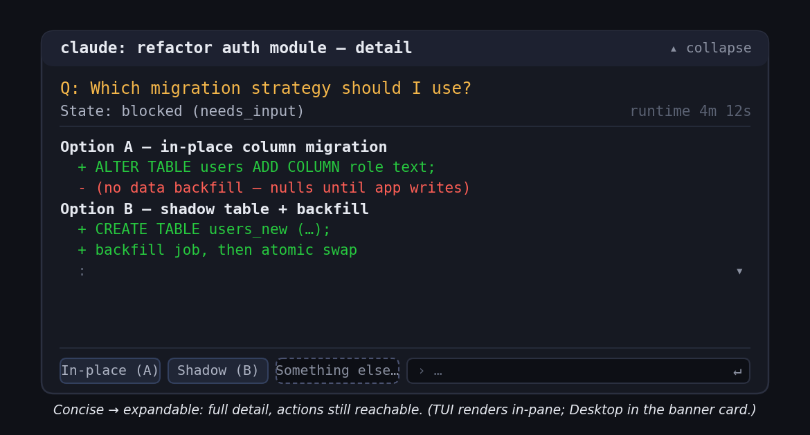
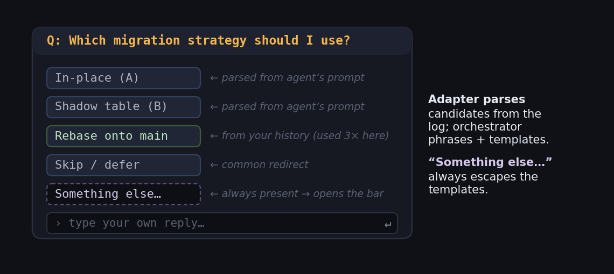
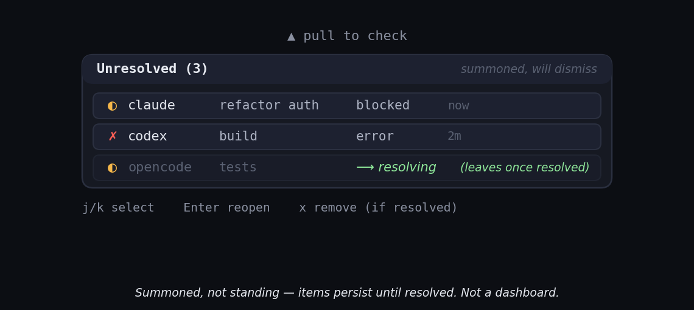

# Mockups Plan

This document specifies the visuals the proposal needs, what each one must show, and how to produce it. It mirrors the role of the `docs/mockups/` folder in a design-proposal repo: the README embeds the rendered images, and this plan is the brief a designer (or an image-generation pass) works from.

Every mockup must reinforce the two theses: **(1)** the tool is absent-by-default and proportional, never a persistent dashboard; and **(2)** both variants carry inline actions *and* jump-to-pane, differing only in emphasis.

| # | File                          | Surface                                   | Used in                          |
| - | ----------------------------- | ----------------------------------------- | -------------------------------- |
| 0 | `original-concept.png`        | The mobile-notification metaphor          | README (Documentation)           |
| 1 | `tui-overlay-mockup.png`      | In-TUI floating overlay (fzf-style)       | README (Proposal A), TUI TDD §6  |
| 2 | `desktop-banner-mockup.png`   | Custom slide-in banner (topmost, no focus) | README (Proposal B), Desktop TDD §5 |
| 3 | `expanded-detail-mockup.png`  | Expanded detail view with inline actions  | Both TDDs (inline action surface)|
| 4 | `template-actions-mockup.png` | Templated responses to the question + "Something else…" | Both TDDs (inline action surface)|
| 5 | `pull-surface-mockup.png`     | Pull surface / backlog stack              | TUI TDD §9, Desktop TDD §5       |

The ASCII sketches below double as (a) the layout brief for a rendered image and (b) a usable fallback if the PNG isn't produced — the reference repo embeds ASCII previews directly in Markdown, and this repo does the same.

---

## 0. Original Concept Sketch

**Purpose:** anchor the whole proposal in the mobile-notification metaphor it borrows from, so a reader immediately understands the design language.

**Must show:** a phone-style notification shade being pulled down, with (a) a concise notification collapsed, (b) the same one expanded, (c) a templated-response button row, (d) an inline reply bar, and (e) a stack of piled notifications with the most recent on top. Annotate each with the terminal-agent equivalent (name → command, body → **the agent's log gist phrased as a question**, buttons → templated responses + "Something else…", bar → custom reply routed to the session, stack → backlog of unresolved interrupts).

**How to produce:** a simple annotated illustration; can be hand-sketched or generated. It is explicitly the "here is the metaphor" figure. Include the drop-down-then-slide-up motion and a note that the banner dwells (~10s, configurable) before retracting into the stack.

**Rendered:**


---

## 1. TUI Floating Overlay

**Purpose:** show delivery when the user is still in a terminal — an ephemeral overlay in the focused pane, fzf `Ctrl-R` in feel.

**Must show:** the overlay floating over dimmed terminal content behind it; name + state on the top line; the gist **phrased as a question**; a row of numbered templated responses plus a "Something else…" entry; the inline prompt bar; the hotkey legend (`d expand · g jump · Esc dismiss`); a dwell countdown (`⏱ 10s`) conveying it auto-retracts; and the backlog indicator (`N more unresolved`). Emphasis cue: inline actions visually prominent, jump-to-pane present but quieter.

**Layout brief (also the Markdown fallback):**

```
  ┌─ terminal content (dimmed) ─────────────────────────┐
  │  $ npm test                                          │
  │  ⋮                                                    │
  │     ┌─ ● agent needs you ─────────────────────────┐  │
  │     │  claude: refactor auth module      blocked ◐ │  │
  │     │  Which migration strategy should I use?       │  │  ← gist as a question
  │     │                                               │  │
  │     │  [1 In-place (A)] [2 Shadow (B)] [3 Skip]     │  │  ← templated responses
  │     │  [4 Something else…]  › ____________  ↵send   │  │  ← custom reply
  │     │                                               │  │
  │     │  d expand   g jump to pane   Esc dismiss      │  │  ← jump present, quieter
  │     └───────────────────────────────────────────────┘  │
  │  2 more unresolved ▾                                  │
  └───────────────────────────────────────────────────────┘
```

**How to produce:** render a real terminal, screenshot, composite the overlay; or generate to match this layout with a monospace terminal aesthetic (dark background, box-drawing characters, a single accent color for the status dot).

**Rendered:**


---

## 2. Desktop Slide-In Banner

**Purpose:** show delivery when the user has left the terminal — the differentiating case, built first. Must read as an Android/iOS-style banner the tool draws itself, sliding down from the top edge, *on top of* the user's current app but not stealing their keyboard.

**Must show:** a banner sliding down from the **top edge** over a non-terminal app (e.g. a browser) to make "the user is away" legible; a motion cue for the drop-down (and a note that it dwells ~10s then slides back up) and a caption noting it is topmost-but-not-focused (the browser's text caret still blinks); title = command, state badge = BLOCKED; the gist **phrased as a question** with an "(expand for diffs)" affordance; templated response buttons including a prominent **Go to pane →** (primary emphasis for this variant); a "Something else…" custom-reply entry with an input box (noted as active only after a click); and, below, the tool's own backlog stack of unresolved interrupts, three items newest-first, each with a state glyph and relative time.

**Layout brief (also the Markdown fallback):**

```
  (background: a browser window, clearly not a terminal — caret still
   blinks in the browser; the banner has NOT stolen focus)

     ▼ slides down from top edge — topmost, SWP_NOACTIVATE
  ┌─ Agent Interrupt Notifier ─────────────── now ─┐
  │  ● claude — refactor auth module      BLOCKED  │
  │  Which migration strategy should I use?         │  ← gist as a question
  │  (expand for both diffs)                         │
  │                                                  │
  │  [ In-place (A) ] [ Shadow (B) ] [ Go to pane →]│  ← jump = primary emphasis
  │  [ Something else… ]  › type a reply…        ↵   │  ← custom reply, active on click
  └──────────────────────────────────────────────────┘

     ▸ Backlog stack (unresolved, newest first)
       ● codex    build failed        2m ago
       ◐ claude   waiting on input    5m ago
       ◐ opencode waiting on input    6m ago
```

**How to produce:** compose over a real Windows desktop screenshot for authenticity, or generate a custom banner aesthetic (rounded card, drop shadow, top-edge slide). It should look like the tool's *own* notification, not a native Windows toast — the design owns this surface. Convey "on top but not focused" with the background app's caret/selection still visible.

**Rendered:**


---

## 3. Expanded Detail View with Inline Actions

**Purpose:** demonstrate the "concise, then expandable" principle — the same notification opened to full detail while keeping the actions reachable.

**Must show:** the notification expanded to reveal full agent output / prompt / log (e.g. both migration diffs behind the collapsed question); scroll affordance for long content; and the templated responses + "Something else…" bar still present at the bottom so the user can act after reading. Show this once in a neutral frame usable by both variants (note in-caption which chrome differs per variant).

**Layout brief:**

```
  ┌─ claude: refactor auth module — detail ──────── ▴ collapse ─┐
  │  Q: Which migration strategy should I use?                  │
  │  State: blocked (needs_input)          runtime 4m 12s        │
  │  ───────────────────────────────────────────────────────── │
  │  Option A — in-place column migration                       │
  │    + ALTER TABLE users ADD COLUMN ...                       │
  │    - (no data backfill)                                     │
  │  Option B — shadow table + backfill                         │
  │    + CREATE TABLE users_new ...                             │
  │    + backfill job, then swap                          ⋮ ▾   │
  │  ───────────────────────────────────────────────────────── │
  │  [ In-place (A) ] [ Shadow (B) ] [ Something else… ] › …  ↵ │
  └───────────────────────────────────────────────────────────── ┘
```

**How to produce:** same rendering approach as #1/#2; the key is showing meaningful, non-lorem detail so the "expand is worth it" point lands.

**Rendered:**



---

## 4. Templated Responses to the Question

**Purpose:** show that the response buttons are **derived** — the adapter parses candidate options from the log, the orchestrator phrases the question and turns candidates + history into templated replies — not fixed labels. And that "Something else…" always escapes the templates.

**Must show:** the question at top, then a button set with a small "why these" annotation indicating each template's source (parsed from the agent's prompt, from your history, from repo convention), plus the always-present "Something else…" that opens the freeform bar. Include a mix: options lifted from the log (In-place / Shadow table), a history-derived redirect (Rebase onto main first), and the custom escape hatch.

**Layout brief:**

```
  ┌─ Q: Which migration strategy should I use? ─────────────────┐
  │  [ In-place (A) ]        ← parsed from agent's prompt        │
  │  [ Shadow table (B) ]    ← parsed from agent's prompt        │
  │  [ Rebase onto main ]    ← from your history (used 3× here)  │
  │  [ Skip / defer ]        ← common redirect                   │
  │  [ Something else… ]     ← always present → opens the bar    │
  │                                                              │
  │  › type your own reply…                                  ↵   │
  └──────────────────────────────────────────────────────────────┘
```

**How to produce:** annotated version of the button set from #1/#2; the annotations (showing adapter-parsed vs orchestrator-generated vs history) are the whole point, so keep them legible. Make "Something else…" visually distinct as the escape hatch.

**Rendered:**



---

## 5. Pull Surface / Backlog Stack

**Purpose:** show the "swipe down to check" equivalent — on-demand, newest-first, items leave only when their interrupt is resolved. Reinforces "not a dashboard": it is summoned, not standing.

**Must show:** the backlog opened on demand (a pull affordance at the top edge), items stacked newest-first with state glyphs and times, one item mid-removal to convey "an item leaves only when its interrupt is resolved (or superseded)," and a clear visual that this surface is transient (e.g. a dimmed background it overlays and will vanish back into). For the desktop variant, note in-caption that this is the tool's own backlog stack; for TUI, it is the summoned overlay list.

**Layout brief:**

```
   ▲ pull to check
  ┌─ Unresolved (3) ────────────────── summoned, will dismiss ─┐
  │ ◐ claude    refactor auth        blocked   now             │  ← newest on top
  │ ✗ codex     build                error     2m              │
  │ ◐ opencode  tests              waiting    5m   ⟶ resolving │  ← leaves once resolved
  └────────────────────────────────────────────────────────────┘
     j/k select   Enter reopen   x remove (if resolved)
```

**How to produce:** render the stack with a subtle motion cue (the resolving row fading/sliding out) if the medium allows; otherwise annotate. Emphasize transience of the *surface* (summoned, not standing) while making clear items *persist until resolved* — it must not read as a dashboard.

**Rendered:**



---

## Production notes

- **Consistency:** one status-glyph vocabulary across every mockup — `●` running, `◐` waiting/blocked, `✓` done, `✗` error, `○` pending.
- **Emphasis discipline:** in TUI mockups the inline bar/buttons are visually dominant; in Desktop mockups **Go to pane →** is dominant. Both affordances appear in both — never drop one.
- **Never persistent:** every mockup should read as transient/summoned. If a frame looks like it could sit on screen all day, it is off-brief.
- **Real content:** use plausible agent prompts and diffs, not lorem ipsum, so the expand/detail value is self-evident.
