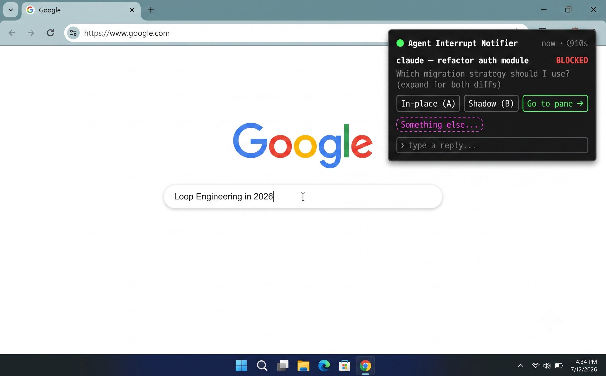
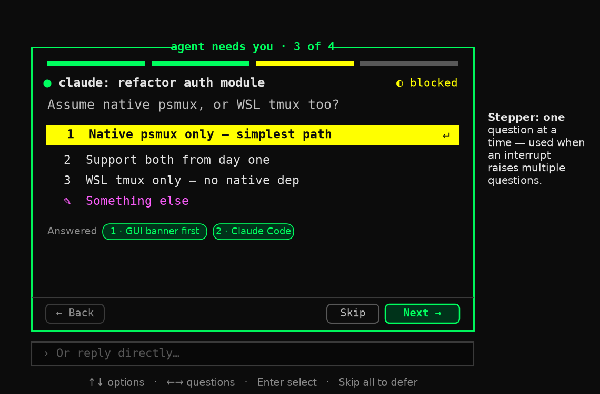

# Mockups

These images are rendered from the briefs in [`MOCKUPS-PLAN.md`](MOCKUPS-PLAN.md). The ASCII previews in the main README and the technical-design docs remain as text fallbacks.

Rendered images:

- `original-concept.png` — the mobile-notification metaphor mapped to terminal agents
- `tui-overlay-mockup.png` — in-TUI floating overlay (fzf-style)
- `desktop-banner-mockup.png` — custom slide-in banner (topmost, no focus steal)
- `expanded-detail-mockup.png` — expanded detail view with inline actions
- `template-actions-mockup.png` — templated responses to the question + "Something else…"
- `pull-surface-mockup.png` — pull surface / backlog stack
- `stepper-mockup.png` — stepper card for an interrupt with 4+ questions







## Regenerating

The images are produced by `_render.py` (matplotlib). To regenerate after editing a brief:

```
python3 _render.py
```

`_render_common.py` holds the shared palette and drawing helpers. Both scripts write the PNGs into their own directory, so run them from anywhere.
